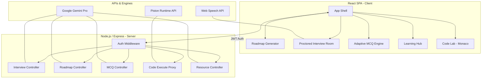

# HireMe: AI-Powered Career Intelligence Platform

HireMe is a professional, high-performance career preparation ecosystem. It leverages Google's Gemini AI to provide job-seekers with automated resume analysis, personalized learning paths, adaptive testing, and a proctored mock interview environment.

## 🚀 Key Features

- **AI Roadmap & Gap Analysis**: Upload a resume and JD to get a step-by-step learning path.
- **Proctored Mock Interview**: Speech-only, real-time interview with tab-switch detection and AI evaluation.
- **Adaptive MCQ Assessment**: High-stakes testing where difficulty scales based on your performance.
- **Skill Resource Library**: Instantly generate curated learning links (Docs, Free Courses, Certs).
- **Code Lab**: Integrated Monaco-powered editor with remote execution for 6+ languages.
- **Enterprise UI**: Minimalist, high-contrast Black & White theme as a zero-scroll SPA.

---

## 🏛️ System Architecture



---

## 🛠️ Technology Stack

- **Frontend**: React.js, Vite, Monaco Editor, Lucide Icons, Axios.
- **Backend**: Node.js, Express, Mongoose.
- **AI**: Google Generative AI (Gemini Flash/Pro).
- **Database**: MongoDB (Local/Atlas).
- **Execution**: Piston Remote Runtime.
- **Theme**: Custom Vanilla CSS (B&W Professional Tone).

---

## 📦 Project Structure

```text
HireMe_Project/
├── client/                 # React frontend
│   ├── src/
│   │   ├── pages/         # Feature implementations
│   │   ├── components/    # Reusable UI components
│   │   └── App.css        # Global Professional Theme
│   └── package.json
├── server/                 # Node.js backend
│   ├── controllers/       # Business & AI logic
│   ├── routes/            # API endpoints
│   ├── middleware/        # JWT Authentication
│   └── server.js          # Entry point
├── .gitignore              # Dependency & Env protection
└── README.md               # Documentation
```

---

## ⚙️ Installation & Setup

### 1. Clone the repository
```bash
git clone https://github.com/your-username/HireMe_Project.git
cd HireMe_Project
```

### 2. Configure Environment Variables
Create a `.env` file in the `server/` directory:
```env
PORT=5000
MONGO_URI=your_mongodb_uri
JWT_SECRET=your_secret_key
GEMINI_API_KEY=your_gemini_api_key
```

### 3. Install Dependencies & Run
**Server:**
```bash
cd server
npm install
npm run dev
```

**Client:**
```bash
cd client
npm install
npm run dev
```

---

## 📄 License
MIT License - Created for Professional Career Enhancement.
